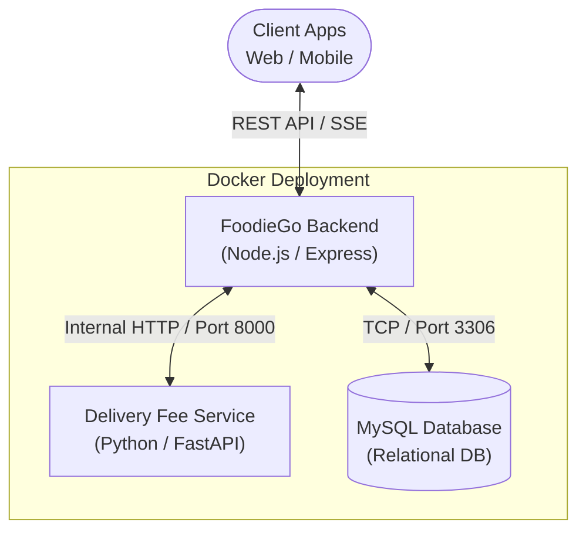

# Tài liệu Kiến trúc Hệ thống (System Architecture) - FoodieGo

Tài liệu này mô tả tổng quan về kiến trúc tổng thể, mô hình triển khai, luồng dữ liệu và thiết kế chi tiết bên trong mã nguồn của hệ thống FoodieGo.

## 1. Kiến trúc Tổng thể (High-level Architecture)

FoodieGo được thiết kế theo hướng **Service-Oriented Architecture (SOA)** với một dịch vụ lõi (Core Backend) và các dịch vụ chuyên biệt (Microservices).



### Các thành phần chính:
- **Client**: Giao tiếp với Backend thông qua các chuẩn RESTful API và nhận thông báo thời gian thực qua Server-Sent Events (SSE).
- **Core Backend (Node.js / Express)**: Thành phần trung tâm xử lý toàn bộ nghiệp vụ chính: Xác thực (Auth), Quản lý Cửa hàng, Quản lý Đơn hàng, v.v.
- **Delivery Service (Python / FastAPI)**: Một microservice độc lập chịu trách nhiệm chuyên tính toán phí giao hàng (Delivery Fee) dựa trên khoảng cách hoặc các thuật toán phức tạp hơn sau này.
- **MySQL Database**: Lưu trữ dữ liệu quan hệ đồng bộ (RDBMS) tập trung.

## 2. Mô hình Thiết kế Mã nguồn (Backend Design Pattern)

Phần Backend được thiết kế theo hướng **Modular Architecture** (Kiến trúc theo module/tính năng) thay vì MVC truyền thống.

**Cấu trúc thư mục lõi:**
```text
backend/src/
├── app.js               # Khởi tạo Express app, global middlewares, global error handler
├── server.js            # Khởi chạy HTTP Server (gắn với cổng)
├── config/
│   └── db.js            # Cấu hình kết nối và connection pool cho MySQL
├── middlewares/         # Middleware dùng chung (vd: auth.middleware.js, error_handler)
└── modules/             # Chia thư mục theo từng tính năng (Domain-Driven)
    ├── admin/           # module thống kê admin
    ├── auth/            # module xác thực
    ├── flash-sales/     # module khuyến mãi giờ vàng
    ├── loyalty/         # module tích điểm
    ├── menu-items/      # module thực đơn
    ├── notifications/   # module thông báo thời gian thực (SSE)
    ├── orders/          # module đơn hàng
    ├── restaurants/     # module quản lý nhà hàng
    └── users/           # module người dùng

**Tại sao chọn Modular Architecture?**
- **Tính đóng gói (Encapsulation):** Mỗi module chứa sẵn Router, Controller, Service và Tests của riêng nó. 
- **Dễ bảo trì và mở rộng:** Khi hệ thống phình to, việc sửa đổi một tính năng (ví dụ: Orders) chỉ khoanh vùng trong thư mục `modules/orders` mà không ảnh hưởng tới các file rải rác khác.

## 3. Luồng dữ liệu tiêu biểu (Data Flow)

### Kịch bản: Khách hàng đặt món
1. **Client** gửi một `POST /api/orders` request với giỏ hàng.
2. **`orders.router.js`** tiếp nhận request, gọi middleware `authenticateUser` để xác minh token JWT.
3. **Backend** gửi request nội bộ tới **Delivery Service** (`http://delivery-service:8000/calculate`) để tính toán phí ship.
4. **Backend** tính tổng tiền (gồm phí ship, áp dụng Vouchers/Loyalty Points).
5. **Backend** dùng Transaction (Giao dịch) ghi vào Database MySQL qua bảng `orders` và `order_items`.
6. Trả kết quả (201 Created) về cho **Client**.
7. Bắn một event qua **`notifications`** module để thông báo cho Nhà hàng qua Server-Sent Events (SSE).

## 4. Mô hình Triển khai (Deployment Architecture)

FoodieGo sử dụng **Docker Compose** để container hóa (Containerization) toàn bộ hệ thống, đảm bảo môi trường dev/prod đồng nhất.

- `foodiego_db`: Container chạy MySQL 8.0, mapping data volume, chạy scripts khởi tạo từ `backend/migrations`.
- `foodiego_backend`: Container chạy Node.js, expose port 3000, nối trực tiếp vào network của MySQL.
- `foodiego_delivery`: Container chạy Python, expose port 8000.

Lợi ích: Chỉ cần gõ lệnh `docker-compose up -d`, toàn bộ hệ thống gồm DB, Core và Microservice sẽ tự động link với nhau theo đúng network chuẩn, giúp team phát triển làm việc trơn tru không cần cài đặt môi trường phức tạp.
